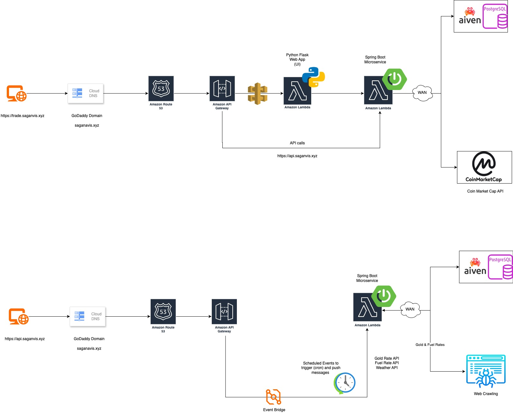

<!--
title: 'Serverless Framework Python Flask API on AWS'
description: 'This template demonstrates how to develop and deploy a simple Python Flask API running on AWS Lambda using the Serverless Framework.'
layout: Doc
framework: v4
platform: AWS
language: Python
priority: 2
authorLink: 'https://github.com/serverless'
authorName: 'Serverless, Inc.'
authorAvatar: 'https://avatars1.githubusercontent.com/u/13742415?s=200&v=4'
-->

# Serverless Framework Python Flask API on AWS

This template demonstrates how to develop and deploy a simple Python Flask API service running on AWS Lambda using the Serverless Framework.

This template configures a single function, `api`, which is responsible for handling all incoming requests thanks to configured `http` events. To learn more about `http` event configuration options, please refer to [http event docs](https://www.serverless.com/framework/docs/providers/aws/events/apigateway/). As the events are configured in a way to accept all incoming requests, `Flask` framework is responsible for routing and handling requests internall y. The implementation takes advantage of `serverless-wsgi`, which allows you to wrap WSGI applications such as Flask apps. To learn more about `serverless-wsgi`, please refer to corresponding [GitHub repository](https://github.com/logandk/serverless-wsgi). Additionally, the template relies on `serverless-python-requirements` plugin for packaging dependencies from `requirements.txt` file. For more details about `serverless-python-requirements` configuration, please refer to corresponding [GitHub repository](https://github.com/UnitedIncome/serverless-python-requirements).

## Architecture



## Usage

### Deployment

This example is made to work with the Serverless Framework dashboard, which includes advanced features such as CI/CD, monitoring, metrics, etc.

In order to deploy with dashboard, you need to first login with:

```
serverless login
```

install dependencies with:

```
npm install
```

and

```
pip install -r requirements.txt
```

and then perform deployment with:

```
serverless deploy
```

After running deploy, you should see output similar to:

```
Deploying "aws-python-flask-api" to stage "dev" (us-east-1)

Using Python specified in "runtime": python3.12

Packaging Python WSGI handler...

✔ Service deployed to stack aws-python-flask-api-dev (104s)

endpoints:
  ANY - https://xxxxxxxxxe.execute-api.us-east-1.amazonaws.com/dev/
  ANY - https://xxxxxxxxxx.execute-api.us-east-1.amazonaws.com/dev/{proxy+}
functions:
  api: aws-python-flask-api-dev-api (41 MB)

```

_Note_: In current form, after deployment, your API is public and can be invoked by anyone. For production deployments, you might want to configure an authorizer. For details on how to do that, refer to [http event docs](https://www.serverless.com/framework/docs/providers/aws/events/apigateway/).

### Invocation

After successful deployment, you can call the created application via HTTP:

```
curl https://xxxxxxx.execute-api.us-east-1.amazonaws.com/dev/
```

Which should result in the following response:

```json
{ "message": "Hello from root!" }
```

Calling the `/hello` path with:

```
curl https://xxxxxxx.execute-api.us-east-1.amazonaws.com/dev/hello
```

Should result in the following response:

```json
{ "message": "Hello from path!" }
```

### Local development

Thanks to capabilities of `serverless-wsgi`, it is also possible to run your application locally, however, in order to do that, you will need to first install `werkzeug` dependency, as well as all other dependencies listed in `requirements.txt`. It is recommended to use a dedicated virtual environment for that purpose. You can install all needed dependencies with the following commands:

```
pip install werkzeug
pip install -r requirements.txt
```

At this point, you can run your application locally with the following command:

```
serverless wsgi serve
```

For additional local development capabilities of `serverless-wsgi` plugin, please refer to corresponding [GitHub repository](https://github.com/logandk/serverless-wsgi).
